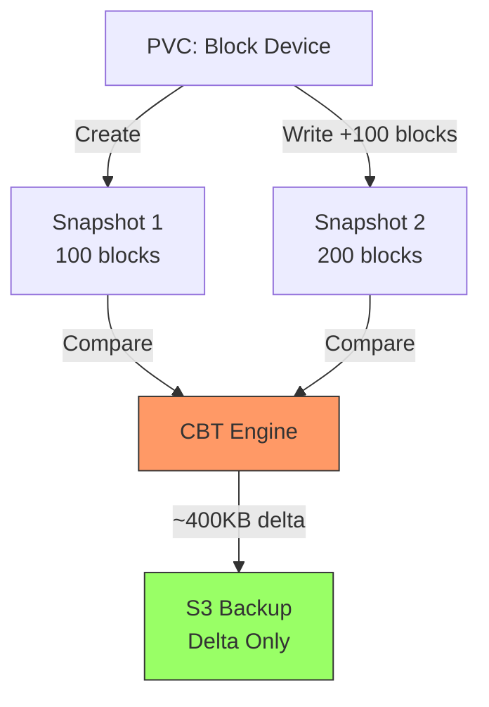
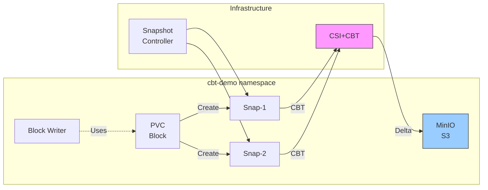

# K8s CBT S3Mover Demo

Efficient Backup with Changed Block Tracking

<div class="pt-12">
  <span @click="$slidev.nav.next" class="px-2 py-1 rounded cursor-pointer" hover="bg-white bg-opacity-10">
    Press Space to begin <carbon:arrow-right class="inline"/>
  </span>
</div>

<!--
Welcome! This presentation demonstrates Changed Block Tracking (CBT) in Kubernetes.
- Introduce yourself and your role
- Mention timeline: K8s 1.33 alpha, OCP 4.20 DevPreviewNoUpgrade, K8s 1.36 proposed beta
- Set expectations: ~25 minute talk with technical deep-dive
- Audience: DevOps engineers, backup admins, K8s storage users
-->


---
transition: slide-left
---

# The "Holy Grail" of Efficient Backups

<div class="grid grid-cols-2 gap-4">
<div>

### The Problem
If you have a **1TB disk** but only change **1MB of data**, you don't want to back up the whole 1TB again.

### The Gap
For a long time:
- **Ceph** had the *ability* to track changes.
- **Kubernetes** had no standard way to *ask* for them.

The evolution of CBT is essentially the story of closing that communication gap.

</div>
<div>

<div class="flex items-center justify-center h-full">
<div class="text-center p-4 bg-gray-100 rounded-lg dark:bg-gray-800">
  <div class="text-6xl mb-4">🏆</div>
  <div class="text-xl font-bold">Tracking Changes</div>
  <div class="text-sm opacity-75">Between Snapshots</div>
</div>
</div>

</div>
</div>

---
transition: slide-left
---

# 1. The "Native" Era (What Ceph always had)

It is important to understand that Ceph's backend (**RBD**) has supported this for years.

<v-clicks>

- **The Tool**: `rbd diff`
- **How it works**:
  - Given `Snapshot-A` and `Snapshot-B`
  - Ceph returns a list of exactly which blocks changed.
- **The Problem**:
  - Kubernetes didn't know this command existed.
  - **CSI** was designed to *create* and *delete* volumes, not to inspect their data contents.

</v-clicks>

---
transition: slide-left
---

# 2. The "Workaround" Era (Pre-Standardization)

Before KEP-3314, backup tools (Velero, Kasten) had two bad choices:

<div class="grid grid-cols-2 gap-8 mt-8">

<v-click>
<div class="p-4 border border-red-500 rounded bg-red-50 dark:bg-red-900/20">
  <h3 class="text-red-600 dark:text-red-400 font-bold">The "Full Scan" Method</h3>
  <p class="mt-2">Read the entire disk every time to find changes.</p>
  <div class="mt-4 text-sm font-mono">Result: Slow & Expensive 🐢</div>
</div>
</v-click>

<v-click>
<div class="p-4 border border-orange-500 rounded bg-orange-50 dark:bg-orange-900/20">
  <h3 class="text-orange-600 dark:text-orange-400 font-bold">The "Proprietary" Method</h3>
  <p class="mt-2">Bypass K8s and talk directly to Ceph API.</p>
  <div class="mt-4 text-sm font-mono">Result: Broken Portability 🔒</div>
</div>
</v-click>

</div>

---
transition: slide-left
---

# 3. The "Modern" Era (KEP-3314)

**KEP-3314: CSI Snapshot Metadata Service** changed the architecture.

<div class="mt-4">

| Component | Old Ceph CSI | New Ceph CSI (With CBT) |
| :--- | :--- | :--- |
| **Primary Job** | Mount/Unmount volumes | Mount/Unmount + **Serve Metadata** |
| **New Sidecar** | None | **`external-snapshot-metadata`** |
| **New RPC Call** | None | `GetMetadataDelta` (The magic command) |
| **Data Flow** | K8s $\rightarrow$ Ceph | K8s $\rightarrow$ Sidecar $\rightarrow$ Ceph CSI $\rightarrow$ `rbd diff` |

</div>

<div class="mt-4 text-sm opacity-75">
Instead of just being a "dumb" driver, Ceph CSI now exposes `rbd diff` data to Kubernetes in a standard way.
</div>

---
transition: slide-left
---

# How it works today (The Workflow)

When a backup tool (like Velero) runs with CBT enabled:

<v-clicks>

1.  **Ask**: Backup tool asks K8s for "Delta" between snapshots
2.  **Route**: Request goes to **CSI Snapshot Metadata Service**
3.  **Translate**: **Ceph CSI driver** translates to `rbd diff`
4.  **Respond**: Ceph responds with offset list of changed blocks
5.  **Transfer**: Backup tool downloads *only* those specific blocks

</v-clicks>

<v-click>
<div class="mt-8 p-3 bg-blue-100 dark:bg-blue-900/30 rounded text-center text-sm">
  Ceph is just one example. This is a standard, so more vendors will support it in the future.
</div>
</v-click>

<!--
- Ceph is used as an example because it already has rbd diff
- The standard (KEP-3314) makes this portable across CSI drivers
- Any vendor can implement SnapshotMetadata gRPC service
-->

---
transition: slide-left
---

# What is CBT?

Changed Block Tracking (**KEP-3314**) identifies **only the blocks** that have changed between snapshots, enabling efficient incremental backups.

<div class="grid grid-cols-2 gap-8 mt-4">
<div>

<v-clicks>

- **K8s 1.33** — Alpha (no feature gate)
- **OCP 4.20** — DevPreviewNoUpgrade
- **K8s 1.36** — Proposed Beta target
- **OCP 5.0** — Expected K8s 1.36 beta

</v-clicks>

<v-click>
<div class="mt-4 p-2 bg-yellow-900 bg-opacity-20 rounded text-sm">

CBT is supported only for **block volumes**, not file volumes

</div>
</v-click>

</div>
<div>

<v-click>


```mermaid {scale:0.55}
graph TB
    PVC[PVC: Block Device]
    S1[Snapshot 1<br/>100 blocks]
    S2[Snapshot 2<br/>200 blocks]
    CBT[CBT Engine]
    S3[S3 Backup<br/>Delta Only]

    PVC -->|Create| S1
    PVC -->|Write +100 blocks| S2
    S1 -->|Compare| CBT
    S2 -->|Compare| CBT
    CBT -->|~400KB delta| S3

    style CBT fill:#f96,stroke:#333
    style S3 fill:#9f6,stroke:#333
```

</v-click>

</div>
</div>

<!--
- KEP-3314 introduces CBT as alpha in K8s 1.33+ (no feature gate), OCP 4.20 DevPreviewNoUpgrade
- Timeline: K8s 1.36 proposed beta (estimated OCP 5.0), last 4.x is 4.23
- Note the block volume requirement - this is critical!
-->

---
transition: slide-left
---

# Key Benefits of CBT

<v-clicks>

- **Shorter Backup Windows** — Hours to minutes for large datasets
- **Smart Initial Backups** — Only allocated blocks transferred
- **Reduced Resource Usage** — Less network bandwidth and I/O
- **Lower Storage Costs** — No redundant full backups needed
- **True Incremental Backups** — Only changed blocks after initial

</v-clicks>

<!--
- Highlight the time savings (hours to minutes) for large datasets
- Show the diagram animation to illustrate the delta concept
- Emphasize adoption path from alpha to beta across both K8s and OpenShift
-->

---
layout: two-cols
---

# User Stories

## 📦 Full Snapshot Backup

<v-click>

**Actor**: Backup Application
**Goal**: Initial backup of 1TB block volume

**Workflow**:
1. Create VolumeSnapshot of target PVC
2. Query `GetMetadataAllocated` API
3. Receive allocated blocks list (e.g., 400GB)
4. Mount snapshot as block PVC in pod
5. Transfer only allocated blocks to S3

**Result**: Back up 400GB instead of 1TB
**Benefit**: 60% reduction in transfer time

</v-click>

::right::

## 🔄 Incremental Snapshot Backup

<v-click>

**Actor**: Backup Application
**Goal**: Daily backup after data changes

**Workflow**:
1. Create new VolumeSnapshot
2. Query `GetMetadataDelta(base, new)`
3. Receive changed blocks (e.g., 50GB)
4. Mount latest snapshot in pod
5. Transfer only delta blocks to S3

**Result**: Back up 50GB instead of 400GB
**Benefit**: 87.5% reduction in transfer time

</v-click>

<!--
User stories provide practical context:
- Full backup: Shows sparse region skipping (400GB used in 1TB volume)
- Incremental: Shows delta efficiency (50GB changes vs 400GB full)
- Both demonstrate GetMetadataAllocated and GetMetadataDelta APIs
- Real-world numbers help audience understand impact
-->

---
layout: default
---

# CBT API Architecture (KEP-3314)

<div grid="~ cols-2 gap-8" class="text-sm">
<div>

## Three Key Components

<v-clicks depth="2">

1. **CSI SnapshotMetadata Service API**
   - `GetMetadataAllocated` RPC
   - `GetMetadataDelta` RPC

2. **SnapshotMetadataService CRD**
   - Advertises service availability
   - Connection details & CA cert

3. **External Snapshot Metadata Sidecar**
   - Validates K8s auth tokens
   - Translates names to handles
   - Forwards requests to CSI

</v-clicks>

</div>
<div>

<v-click>

## Security Model

- **Authentication**: TokenRequest API
- **Authorization**: RBAC + SubjectAccessReview
- **Transport**: Mutual TLS
- **Token scoping**: Audience-bound

</v-click>

<v-click>

<div class="mt-3">

## Metadata Formats

- **FIXED_LENGTH**: Uniform blocks
- **VARIABLE_LENGTH**: Variable extents

<div class="text-xs mt-1 opacity-70">
Both support resumption via `starting_offset`
</div>

</div>

</v-click>

</div>
</div>

<!--
Technical architecture overview:
- Three key components: Service API (gRPC), CRD (advertises service), Sidecar (auth/translation)
- Security is built-in: TokenRequest API, RBAC, mTLS
- Two metadata formats: FIXED_LENGTH (uniform blocks) vs VARIABLE_LENGTH (extents)
- Resumption support via starting_offset is crucial for large snapshots
- Point out this follows cloud provider CBT patterns (AWS EBS direct APIs, Azure incremental snapshots)
-->

---
layout: default
---

# Demo Architecture

<div grid="~ cols-2 gap-0" class="text-xs">
<div>

## Components

<v-clicks>

1. **CSI Driver** with CBT
   - hostpath (demo), Ceph RBD (production)
   - SnapshotMetadata service

2. **MinIO** S3 storage
   - S3-compatible object storage
   - Backup target

3. **Block Writer** workload
   - Writes directly to raw block device
   - Block device PVC (/dev/xvda)

4. **Snapshot Controller**
   - VolumeSnapshot CRDs
   - Lifecycle management

</v-clicks>

</div>
<div v-click>


```mermaid {theme: 'neutral', scale: 0.45}
graph LR
    subgraph ns["cbt-demo namespace"]
        BW[Block Writer]
        PVC[PVC<br/>Block]
        VS1[Snap-1]
        VS2[Snap-2]
        MinIO[MinIO<br/>S3]
    end

    subgraph infra[Infrastructure]
        CSI[CSI+CBT]
        SC[Snapshot<br/>Controller]
    end

    BW -.->|Uses| PVC
    PVC -->|Create| VS1
    PVC -->|Create| VS2
    VS1 -->|CBT| CSI
    VS2 -->|CBT| CSI
    CSI -->|Delta| MinIO
    SC --> VS1
    SC --> VS2

    style CSI fill:#f9f,stroke:#333
    style MinIO fill:#9cf,stroke:#333
```

</div>
</div>

<!--
Demo components walkthrough:
- LEFT: Explain the layered architecture from app to infrastructure
- RIGHT: Walk through the mermaid diagram
- CSI Driver: Note it includes both hostpath plugin AND snapshot-metadata sidecar
- MinIO: S3-compatible storage, easier than setting up real S3
- Block Writer: Writes directly to raw block device /dev/xvda, bypassing filesystem for CBT visibility
- Snapshot Controller: Manages VolumeSnapshot lifecycle
- Emphasize: Everything runs in a single namespace for simplicity
-->

---
layout: default
---

# Demo Workflow — Phase 1: Setup

<v-clicks>

- **Deploy Kubernetes Cluster** — Minikube with vfkit (4 CPUs, 8GB RAM)
- **Install Snapshot CRDs** — VolumeSnapshot, VolumeSnapshotContent, VolumeSnapshotClass
- **Deploy CSI Driver with CBT**

</v-clicks>

<v-click>

```bash
./scripts/01-deploy-csi-driver.sh
# Installs SnapshotMetadataService CRD + enables CBT API
```

</v-click>

<!--
Setup phase - emphasize automation:
- Minikube is default, but supports any K8s cluster via KUBECONFIG
- Snapshot CRDs must be installed BEFORE CSI driver
- CSI driver deployment includes TLS cert generation and sidecar injection
- Scripts handle all complexity automatically
- macOS: Use vfkit driver (not Podman) for block volume support
-->

---
layout: default
---

# snapshot-metadata-lister Pod

The **snapshot-metadata-lister** acts as an **authenticated client** to access CBT APIs:

<v-clicks>

- **Token Validation** — ServiceAccount tokens via TokenRequest API
- **Name → Handle Translation** — VolumeSnapshot names to CSI handles
- **gRPC Proxy** — TLS connection to SnapshotMetadataService (port 6443)

</v-clicks>

<v-click>

```yaml
# RBAC: ServiceAccount + Role for VolumeSnapshot access
rules:
- apiGroups: ["snapshot.storage.k8s.io"]
  resources: ["volumesnapshots"]
  verbs: ["get", "list"]
```

</v-click>

<!--
- This pod bridges Kubernetes RBAC and CSI driver access
- Without it, users cannot directly call CBT APIs
- Token validation ensures only authorized users access metadata
- Name translation allows using friendly snapshot names instead of handles
- TLS-secured gRPC connection to SnapshotMetadataService
- Deployed in Phase 3 before calling GetMetadataAllocated
-->

---

# Demo Workflow (cont.)

<v-clicks depth="2">

## Phase 2: Deploy Workload

4. **Deploy MinIO S3 Storage**
   ```bash
   ./scripts/02-deploy-minio.sh
   ```

5. **Deploy Block Writer**
   ```bash
   ./scripts/03-deploy-workload.sh
   ```
   - Creates block device PVC
   - Writes 100 blocks to raw device

6. **Verify Setup**
   ```bash
   ./scripts/backup-status.sh
   ./scripts/integrity-check.sh
   ```

</v-clicks>

<!--
Workload deployment:
- MinIO provides S3-compatible storage (easier than real S3 for demos)
- Block-writer uses volumeMode: Block - emphasize this requirement
- Initial data: 100 blocks written to raw device /dev/xvda (~400KB)
- Verification scripts ensure everything is working
- This is the baseline for our CBT comparisons
-->

---

# Phase 3: GetMetadataAllocated

<v-clicks>

- **Create First Snapshot** — `kubectl apply -f block-snapshot-1.yaml` (~4s)
- **Deploy snapshot-metadata-lister** — Pod ready in ~62 seconds

</v-clicks>

<v-click>

```bash
# Call GetMetadataAllocated API
kubectl exec csi-client -- /tools/snapshot-metadata-lister \
  -s block-snapshot-1 -n cbt-demo
```

</v-click>

<v-click>

Lists all **allocated blocks** in the snapshot

**Status**: API call completes successfully

</v-click>

<!--
- Snapshot creation is fast (~4 seconds)
- snapshot-metadata-lister pod takes longer to start (62s) due to image pull
- GetMetadataAllocated API call succeeds
- CSI hostpath driver limitation: no actual metadata returned (but API works)
- In production CSI drivers, this would return allocated blocks
-->

---
layout: default
---

# Phase 3: Expected Output

**Expected** (with production CSI driver supporting CBT):

```text {all}{maxHeight:'220px'}
Record#   VolCapBytes  BlockMetadataType   ByteOffset     SizeBytes
------- -------------- ----------------- -------------- --------------
      1     2147483648      FIXED_LENGTH              0           4096
      1     2147483648      FIXED_LENGTH           4096           4096
      1     2147483648      FIXED_LENGTH           8192           4096
      ... (95 more blocks)

Total: 100 blocks allocated (409,600 bytes = ~400KB)
Volume: 2Gi (2,147,483,648 bytes)
```

<v-click>

<div class="mt-3 p-3 bg-green-900 bg-opacity-20 rounded text-sm">

**Sparse Region Detection** — Volume: 2 GB, Allocated: ~400 KB (0.02%), **Savings: 99.98%**

Without CBT, backup tools transfer the entire 2 GB. With CBT, only 400 KB is transferred.

</div>

</v-click>

<!--
- Shows real snapshot-metadata-lister table format
- 100 blocks of 4096 bytes each = 409,600 bytes (~400KB)
- Only ~0.02% of 2Gi volume is allocated
- FIXED_LENGTH format with 4096-byte block granularity
-->

---

# Phase 4: GetMetadataDelta

<v-clicks>

- **Write 100 more blocks** — `dd if=/dev/urandom of=/dev/xvda bs=4096 count=100`
- **Create Second Snapshot** — `kubectl apply -f block-snapshot-2.yaml` (~3.7s)

</v-clicks>

<v-click>

```bash {all}{maxHeight:'180px'}
# Get CSI snapshot handle from VolumeSnapshotContent
VSC=$(kubectl get volumesnapshot block-snapshot-1 -n cbt-demo \
  -o jsonpath="{.status.boundVolumeSnapshotContentName}")
HANDLE=$(kubectl get volumesnapshotcontent $VSC \
  -o jsonpath="{.status.snapshotHandle}")

# Call GetMetadataDelta using CSI handle (PR #180)
kubectl exec csi-client -- /tools/snapshot-metadata-lister \
  -P "$HANDLE" -s block-snapshot-2 -n cbt-demo
```

</v-click>

<v-click>

Reports only **changed blocks** using base snapshot CSI handle

</v-click>

<!--
- Write 100 more blocks to raw device to simulate data changes
- Uses CSI handle approach (PR #180) instead of snapshot names
- Key benefit: Base snapshot can be deleted after getting handle
- This is the key efficiency gain - only ~400KB delta vs full ~800KB
-->

---
layout: default
---

# Phase 4: Expected Output

**Expected** (with production CSI driver supporting CBT):

```text {all}{maxHeight:'200px'}
Record#   VolCapBytes  BlockMetadataType   ByteOffset     SizeBytes
------- -------------- ----------------- -------------- --------------
      1     2147483648      FIXED_LENGTH         409600           4096
      1     2147483648      FIXED_LENGTH         413696           4096
      1     2147483648      FIXED_LENGTH         417792           4096
      ... (95 more blocks)

Total: 100 changed blocks (409,600 bytes = ~400KB delta)
Base Snapshot Handle: 7c0d6daa-1e9d-11ee-8f2a-0242ac110002
```

<v-click>

<div class="mt-3 p-3 bg-blue-900 bg-opacity-20 rounded text-sm">

**PR #180: CSI Handle Support** (merged Oct 2025) — `GetMetadataDelta` accepts CSI snapshot handles instead of names. Base snapshot **can be deleted** after extracting handle. Backward compatible.

</div>

</v-click>

<!--
- Only ~400KB delta instead of ~800KB full backup (50% efficiency)
- With PR #180, base snapshot handle can be used even if snapshot deleted
- ByteOffset starts at 409600 (after first 100 blocks: 100 x 4096)
-->

---
layout: default
---

# Phase 5: Disaster Recovery

<v-clicks>

- **Simulate Disaster** — `./scripts/05-simulate-disaster.sh`
  - Deletes pod and PVC, preserves snapshots
- **Restore from Snapshot** — `./scripts/06-restore.sh cbt-demo block-snapshot-2`
  - Creates new PVC from snapshot, redeploys workload
- **Verify Recovery** — `./scripts/07-verify.sh cbt-demo`
  - Compares checksums, confirms data integrity

</v-clicks>

<v-click>
<div class="mt-4 p-3 bg-green-900 bg-opacity-20 rounded text-sm">

**Result**: Data integrity preserved — post-restore checksum matches pre-disaster

</div>
</v-click>

<!--
- Demonstrates end-to-end disaster recovery using snapshots
- Step 13: Simulate disaster by deleting workload but preserving snapshots
- Step 14: Restore creates PVC from snapshot (native K8s restore)
- Step 15: Verify ensures data integrity with checksum comparison
- Snapshots provide crash-consistent recovery points
-->

---
layout: two-cols
---

# Build Tools

<div class="text-sm">

<v-click>

## Backup Tool (cbt-backup)

**Built in CI** (build-backup-tool job → artifact):

```bash
cd tools/cbt-backup
go mod tidy
go build -v -o cbt-backup ./cmd
```

**Purpose**: Production backup use case
- Integrates CBT APIs for efficient backups
- Uploads to S3-compatible storage
- Supports incremental backups

**Status**: Built and tested in CI, available as artifact

</v-click>

</div>

::right::

<v-click>

## Restore Scripts

```bash
# Dry-run (validate only)
./scripts/restore-dry-run.sh \
  cbt-demo block-snapshot-1

# Full restore from snapshot
./scripts/06-restore.sh \
  cbt-demo block-snapshot-2
```

</v-click>

<v-click>

**Status:**
- `06-restore.sh`: Functional (used in Phase 5)
- `restore-dry-run.sh`: Validation only
- `cbt-restore`: Built, needs block upload in backup

</v-click>

---
layout: center
class: text-center
---

<div class="text-sm">

# Data Integrity

<v-clicks>

## Verification Process

```bash
./scripts/integrity-check.sh
```

<div class="text-xs">

Checks: Snapshot checksums • Block-level consistency • Block device data • Backup metadata

</div>

</v-clicks>

<v-click>

## Results

<div class="text-left mx-auto max-w-2xl mt-4">

| Check | Snapshot 1 | Snapshot 2 |
|-------|-----------|-----------|
| Blocks | 100 | 200 |
| Size | ~400KB | ~800KB |
| Delta | - | ~400KB |
| Checksum | ✓ MD5 | ✓ MD5 |

</div>

</v-click>

</div>

---
layout: default
---

# Troubleshooting

<v-clicks depth="2">

## Common Issues

1. **Snapshot not ready**
   ```bash
   kubectl describe volumesnapshot block-snapshot-1 -n cbt-demo
   kubectl logs -n kube-system -l app.kubernetes.io/name=snapshot-controller
   ```

2. **CSI Driver issues**
   ```bash
   kubectl logs -n default csi-hostpathplugin-0 --all-containers
   kubectl describe pod -n default csi-hostpathplugin-0
   ```

3. **CBT CRD missing**
   ```bash
   kubectl get crd snapshotmetadataservices.cbt.storage.k8s.io
   ./scripts/validate-cbt.sh
   ```

</v-clicks>

---
layout: default
---

# CI/CD Pipeline

**Latest Successful Run**: [#87 (18862281941)](https://github.com/kaovilai/k8s-cbt-s3mover-demo/actions/runs/18862281941)
**Total Time**: 6 minutes (jobs run in parallel)
**Commit**: fix: add explicit container selection and RBAC permissions for lister

<div grid="~ cols-4 gap-4">
<div>

<v-click>

## demo

**End-to-end test** (**5m 24s**)
- Setup cluster
- Deploy components
- Create snapshots
- Test CBT APIs
- **Result**: ✓ Success

</v-click>

</div>
<div>

<v-click>

## build-backup-tool

**Build & test** (**30s**)
- Go 1.22
- Download deps
- Build binary
- Run tests
- **Result**: ✓ Success

</v-click>

</div>
<div>

<v-click>

## lint

**Code quality** (**18s**)
- shellcheck scripts
- go fmt
- go vet
- **Result**: ✓ Success

</v-click>

</div>
<div>

<v-click>

## build-restore-tool

**Placeholder** (**11s**)
- Check status
- Build placeholder
- Future enhancement
- **Result**: ✓ Success

</v-click>

</div>
</div>

<!--
CI/CD automation highlights:
- 4 parallel jobs: demo (end-to-end), build-backup-tool, lint, build-restore-tool
- Total time: 6 minutes for full validation
- Demo job is comprehensive: setup, deploy, snapshot, test CBT APIs
- Runs on every push/PR to main/develop branches
- Latest successful run validates everything works
- This ensures reproducibility and catches regressions
-->

---
layout: default
---

# CI Results (Run #87)

<div class="text-sm">

<div class="grid grid-cols-2 gap-6">
<div>

<v-click>

## Infrastructure Deployed

- **Cluster**: Minikube (4 CPUs, 8GB RAM)
- **CSI Driver**: hostpath canary + metadata sidecar
- **Snapshots**: ~4s creation time each

| Snapshot | Blocks | Size |
|----------|--------|------|
| block-snapshot-1 | 100 | ~400KB |
| block-snapshot-2 | 200 | ~800KB |

</v-click>

</div>
<div>

<v-click>

## API Status

- GetMetadataAllocated: Executes without errors
- GetMetadataDelta: Executes without errors
- **Limitation**: hostpath driver returns no metadata
- **PR #180**: CSI handle support confirmed

</v-click>

</div>
</div>

</div>

<!--
- Full infrastructure deployed successfully in Minikube
- Snapshot creation is very fast (~4s per snapshot)
- APIs execute successfully, hostpath driver doesn't return metadata (expected)
- Production CSI drivers will implement full CBT
- PR #180 support confirmed in canary build (Oct 15, 2025)
-->

---
layout: center
class: text-center
---

# Demo Results

<v-clicks>

## What We Demonstrated

1. ✅ Kubernetes CSI snapshots with CBT support
2. ✅ Changed block tracking between snapshots
3. ✅ Efficient delta backup (~400KB vs ~800KB full)
4. ✅ S3-compatible storage integration
5. ✅ Real workload (block-writer) testing
6. ✅ Automated CI/CD validation

## Key Takeaway

<div class="text-2xl mt-8 text-green-400">
CBT enables <strong>efficient incremental backups</strong> by tracking only changed blocks
</div>

</v-clicks>

<!--
Summary of achievements:
- ✅ Demonstrated full CBT workflow end-to-end
- ✅ Showed both GetMetadataAllocated and GetMetadataDelta APIs
- ✅ Validated S3 storage integration
- ✅ Tested with real block-writer workload (raw block device writes)
- ✅ Automated CI/CD validation
- Key takeaway: CBT reduces backup time and storage by tracking only changes
- Mention: This is alpha in K8s 1.33+, production CSI driver support coming
-->

---
layout: default
---

# Current Demo Limitations

<div grid="~ cols-2 gap-8">
<div>

<v-click>

## ✅ What Works

**Infrastructure & Workflow**
- CBT API calls execute successfully
- End-to-end workflow validated
- TLS-secured gRPC communication
- K8s auth integration (TokenRequest, RBAC)
- Production-ready infrastructure

**PR #180 Features**
- CSI handle support confirmed
- Base snapshot deletion after handle extraction
- Backward compatibility with snapshot names

</v-click>

</div>
<div>

<v-click>

## Current Limitations

**CSI Driver Support**
- hostpath driver: API works, no metadata returned
- Production drivers: **No CBT support yet**

**ARM64 Architecture**
- grpc_health_probe: AMD64-only in upstream
- Fix: `multiarch-grpc-health-probe` branch

**Backup Tool**
- Metadata infrastructure: Complete
- Block data upload to S3: TODO
- Restore tool: Implemented (awaits block upload)

</v-click>

</div>
</div>

<v-click>

<div class="mt-4 p-3 bg-blue-900 bg-opacity-30 rounded text-sm">

💡 **Why This Demo Matters**: Even without full metadata, this validates the **workflow**, **API integration**, and **security model** that production CSI drivers will use when they add CBT support.

</div>

</v-click>

<!--
Limitations slide - set proper expectations:
- LEFT: What actually works and is production-ready
- RIGHT: What's still TODO or waiting on external dependencies
- Bottom: Why this demo is still valuable despite limitations
- Key message: Infrastructure and workflow are ready, waiting on CSI driver vendors
- This prevents disappointment when users try the demo
- Emphasizes that this is groundwork for future production use
-->

---
layout: default
---

# Try It Yourself

<v-clicks>

## Quick Start

```bash
git clone <repo-url>
./scripts/01-deploy-csi-driver.sh
./scripts/02-deploy-minio.sh
./scripts/03-deploy-workload.sh
./scripts/04-run-demo.sh
```

## Demo Resources

- **Docs**: `README.md`
- **Scripts**: `scripts/` directory
- **Tools**: `tools/cbt-backup/`
- **CI**: `.github/workflows/demo.yaml`

</v-clicks>

<!--
Call to action:
- Encourage audience to try the demo themselves
- It's fully automated with scripts - just run them in order
- Works on Minikube or any K8s cluster
- All code is open source and documented
- Point to README.md for details
- Mention: Great way to learn CBT before production CSI drivers support it
-->

---
layout: default
---

# Official Resources

<div grid="~ cols-2 gap-4">
<div>

<v-click>

## Kubernetes Documentation

- 📘 [KEP-3314: CSI Changed Block Tracking](https://github.com/kubernetes/enhancements/tree/master/keps/sig-storage/3314-csi-changed-block-tracking)
- 📚 [CSI Developer Docs](https://kubernetes-csi.github.io/docs/external-snapshot-metadata.html)
- 📝 [Kubernetes Blog Post](https://github.com/kubernetes/website/pull/48456) (upcoming)

</v-click>

</div>
<div>

<v-click>

## Implementation References

- 🔧 [external-snapshot-metadata](https://github.com/kubernetes-csi/external-snapshot-metadata) repo
- 📋 [schema.proto](https://github.com/kubernetes-csi/external-snapshot-metadata/blob/main/proto/schema.proto) - gRPC API definitions
- 💡 [snapshot-metadata-lister](https://github.com/kubernetes-csi/external-snapshot-metadata/tree/main/examples/snapshot-metadata-lister) example
- 🔨 [csi-hostpath-driver](https://github.com/kubernetes-csi/csi-driver-host-path) with CBT

</v-click>

</div>
</div>

<v-click>

## Get Involved

- 🤝 Join [SIG Storage](https://github.com/kubernetes/community/tree/master/sig-storage)
- 🗓️ Attend [Data Protection Working Group](https://docs.google.com/document/d/15tLCV3csvjHbKb16DVk-mfUmFry_Rlwo-2uG6KNGsfw/edit) meetings

</v-click>

<!--
Resources and community:
- KEP-3314 is the source of truth for CBT specification
- external-snapshot-metadata repo has reference implementation
- Point to schema.proto for gRPC API definitions
- snapshot-metadata-lister example shows how to use the APIs
- Encourage joining SIG Storage and Data Protection Working Group
- This is an active area - production CSI driver support coming soon
-->

---
layout: center
class: text-center
---

# Thank You!

Questions?

<div class="pt-12 text-sm opacity-50">
  <p>K8s CBT S3Mover Demo</p>
  <p>Efficient backup with Changed Block Tracking</p>
</div>

<!--
Closing:
- Thank the audience for their time
- Open floor for questions
- Common questions to anticipate:
  - When will production CSI drivers support CBT? (Vendor-dependent, ask your CSI provider)
  - Does this work with EBS/Azure Disk? (Not yet, but KEP-3314 enables it)
  - Is this production-ready? (Alpha in K8s 1.33+, API is stable, CSI driver support needed)
  - How does this compare to cloud provider CBT? (Similar concept, K8s provides standardized API)
- Provide contact info or repo link for follow-up questions
-->
